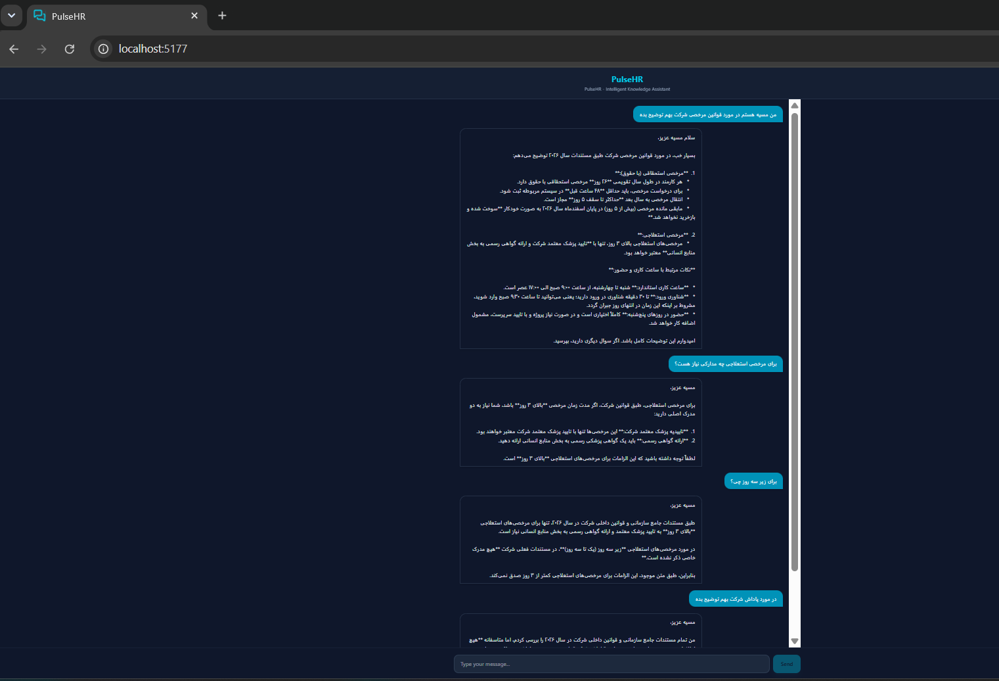

# 🧠 PulseHR | Enterprise RAG Chatbot Platform

**PulseHR** is a domain-agnostic, high-performance **RAG-powered AI Chatbot** designed to act as an intelligent knowledge base assistant. While pre-configured in this repository with an **Enterprise Human Resources (HR) & Internal Policy** use-case, the core architecture is entirely dynamic and adapts to any injected knowledge base.

---

## 🏗️ Core Architecture & Tech Stack

The application follows a modular, decoupled architecture optimized for speed, scalability, and network resilience:

* **Frontend:** React (Responsive UI).
* **Backend API:** FastAPI (Python) using asynchronous patterns (`async/await`) and `asyncio.gather`.
* **AI & Orchestration:** LangChain (LCEL) & Google Gemini (gemini-2.5-flash).
* **Database & Vector Storage:** Supabase (PostgreSQL) with `pgvector` for semantic search.
* **Performance:** Optimized with **Background Tasks** for non-blocking persistence and **Shared Embedding** strategy for reduced latency.
* **Resiliency:** Integrated with **Tenacity** for robust API error handling.

---

## 🚀 Key Features & Performance

* **Non-Blocking Persistence:** Vector embeddings for AI responses are generated and stored via background workers, keeping the UI fluid.
* **Optimized Latency:** Parallel execution of RAG and Memory retrieval.
* **Context-Aware RAG:** Grounds responses in official documentation while maintaining persistent semantic memory across sessions.
* **Shared Embedding Strategy:** Reuses embeddings across the pipeline to minimize API costs and latency.

---
## 🖥️ User Interface Preview
<div align="center">
   
   <p><i>PulseHR: Multi-turn RAG conversation demonstration.</i></p>
</div>

*The intuitive interface designed for seamless interaction with the organizational knowledge base, providing real-time, grounded responses.*

---

## 🛠 Technical Competencies Demonstrated

By building this platform, I have demonstrated proficiency in:

* **Advanced AI Orchestration:** Mastery of **LangChain (LCEL)** for complex LLM workflows and state management.
* **Asynchronous Systems Engineering:** Architecting non-blocking pipelines using **FastAPI** to ensure high throughput.
* **Vector Database Optimization:** Deep understanding of **pgvector** and **HNSW Indexing** for production-grade semantic search performance.
* **Memory & Context Engineering:** Implementation of hybrid memory architectures (Short-term buffer + Long-term Vector Recall).
* **Scalable API Design:** Experience in building robust, resilient APIs with automated retry mechanisms and structured data flow.

---

## 🗄️ Database Schema & Setup

The platform leverages **Supabase (PostgreSQL)** with `pgvector`. 

> **Deployment Guide:** For the complete database setup (tables, HNSW indexes, and RPC functions), refer to the [**`database_setup.sql`**](database_schema.sql) file. Simply copy and execute its content in your Supabase SQL Editor.


---

## 🧠 Memory Management

The platform implements a **Two-Tier Hybrid Memory Architecture**:

1. **Short-Term Memory:** A sliding window buffer for active chat context.
2. **Long-Term Semantic Memory:** Uses vector search (`match_user_messages`) to recall user facts from previous sessions.

### 🔄 Context Fusion Lifecycle

```text
[User Query]
      │
      ├───► Vector Search (Company Docs) ───► [COMPANY CONTEXT] ───┐
      │                                                           ├───► [Fused Gemini Prompt]
      ├───► Vector Search (User History) ───► [SEMANTIC MEMORY]  ──┤
      │                                                           │
      └───► Linear Active History ───► [SHORT-TERM SLIDING WINDOW] ─┘
```
 ## 🛠 Installation

### Clone the repository:

      git clone [https://github.com/sogand20000/hr-pulse-ai.git](https://github.com/sogand20000/hr-pulse-ai.git)

### Install dependencies:

      pip install -r requirements.txt

### Configure Environment:

        Create a .env file and add your SUPABASE_URL, SUPABASE_KEY, and GEMINI_API_KEY.

 ### Deploy Schema:
    Run the SQL scripts provided in database_schema.sql on your Supabase instance.

### Run the server:  
      uvicorn main:app --reload